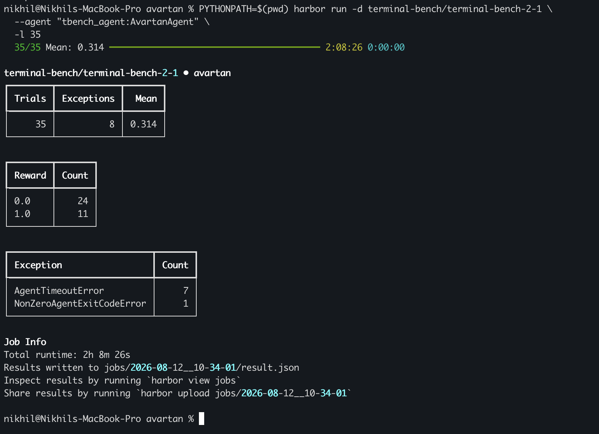
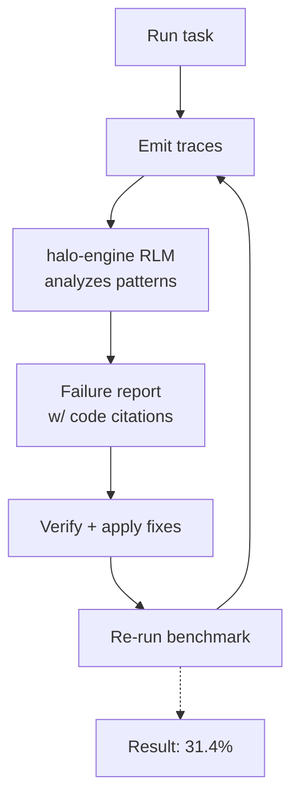

# avartan

A minimal terminal coding agent built from scratch in Python. It talks to an LLM over [OpenRouter](https://openrouter.ai/), lets the model call tools to read/write files, run shell commands, search the web, and spawn sub-agents, and streams responses live to the terminal.

## Architecture

The project is three small modules plus a package manifest — no framework, no hidden abstractions.

```
avartan.py    CLI entry point: env loading, system prompt, tool registry, REPL / --task mode
agent.py      run_turn(): the core streaming + tool-calling loop
tools.py      Tool base class and every concrete tool
pyproject.toml   packaging (pip install -e . / pipx install -e .)
```

### `agent.py` — the agent loop

`run_turn()` is the only piece of "agent" logic in the project. Given a `messages` list, it:

1. Calls `client.chat.completions.create(..., stream=True)`.
2. Streams `delta.content` to stdout as it arrives, and accumulates any `delta.tool_calls` fragments (they arrive in pieces — `id`, `function.name`, and `function.arguments` all stream incrementally, keyed by tool-call index).
3. When the stream ends:
   - If `finish_reason == "tool_calls"`, it appends the assistant's tool-call message, looks up and runs each requested tool, appends the results as `role: tool` messages, and loops back to step 1.
   - If `finish_reason == "stop"`, it appends the assistant's text reply to `messages` and returns it.

This same function powers three different call sites, distinguished only by two flags:

- **Interactive REPL** (`avartan.py`) — prompts `[y/n]` before any non-read-only tool runs.
- **`--task` / `--task-file` mode** (`avartan.py`) — `auto_approve=True` (no human to ask) and `max_iterations` caps the loop so a misbehaving model can't run forever.
- **Sub-agents** (`tools.py`'s `SpawnAgentTool`) — `auto_approve=True`, since the parent agent already had its own call approved.

An unrecognized tool name (e.g. a model hallucinating a tool) doesn't crash the loop — it sends back an `error: no tool named '...'` result and continues.

### `tools.py` — tools

Every tool subclasses `Tool`:

```python
class Tool:
    name: str
    description: str
    parameters: dict       # JSON schema for the arguments
    is_read_only: bool      # gates the permission prompt
    def execute(self, args: dict) -> str: ...
```

`to_openai_tool()` renders a `Tool` into the OpenAI `{"type": "function", "function": {...}}` shape expected by the API.

| Tool | Name | Read-only | Purpose |
|---|---|---|---|
| `ReadFileTool` | `read_file` | ✅ | Read a file's contents |
| `WriteFileTool` | `write_file` | ❌ | Overwrite/create a file |
| `EditFileTool` | `edit_file` | ❌ | Replace an exact string in a file (errors if not found) |
| `GrepTool` | `grep` | ✅ | Regex search across a directory |
| `BashTool` | `bash` | ❌ | Run a shell command, return stdout+stderr |
| `TodoWriteTool` | `todo_write` | ✅ | Store/render a checklist for planning |
| `WebSearchTool` | `web_search` | ✅ | Firecrawl web search |
| `SpawnAgentTool` | `task` | ❌ | Run a fresh sub-agent to completion, return its final answer |

**Permission gate**: any non-read-only tool call is confirmed with the user before running, unless the caller passed `auto_approve=True` or **plan mode** is active — in which case it's auto-denied instead (`"denied: plan mode active — read-only tools only"`), so the model can only inspect the codebase and lay out a plan via `todo_write`.

### `avartan.py` — entry point

On startup it:

1. Loads `.env` from its own directory (`Path(__file__).parent / ".env"`, not the caller's `cwd`) via `python-dotenv`, so `avartan` works from any directory once installed.
2. Builds a system prompt from three parts: identity/behavior instructions, an environment block (`cwd`, OS, file listing), and the contents of `AVARTAN.md` in the current directory if one exists (project-specific instructions).
3. Registers all tools, with `SpawnAgentTool` wired to the same system prompt and every other tool (never itself, to avoid recursive spawning).

Then either:

- **REPL mode** (default): reads input in a loop, keeping full conversation history. Typing `/plan` toggles plan mode. `Ctrl+C` exits cleanly (prints `Exiting.`, exit code 0).
- **Task mode** (`--task "..."` or `--task-file path.txt`): seeds history with a single user message and runs one `run_turn()` to completion, auto-approving every tool call, capped at `--max-iterations` (default 50).

## Setup

```bash
python3 -m venv .venv
source .venv/bin/activate
pip install -e .
```

Or install globally with [pipx](https://pipx.pypa.io/) (no venv activation needed):

```bash
pipx install -e .
```

Copy `.env` and fill in your keys (never commit this file):

```
OPENROUTER_API_KEY=...
FIRECRAWL_API_KEY=...
```

## Usage

```bash
avartan                              # interactive REPL
avartan --task "list the files here" # one-shot, non-interactive
avartan --task-file task.txt --max-iterations 20
```

## Configuration

Drop an `AVARTAN.md` file in a project's root directory to append project-specific instructions to avartan's system prompt whenever it's run from that directory.

## Self-Improvement Loop (HALO)

avartan was built from scratch, then benchmarked against [Terminal-Bench 2.1](https://www.tbench.ai/) and run through 2 full HALO (Hierarchical Agent Loop Optimization) cycles: trace collection → RLM analysis via `halo-engine` → harness fixes → re-measure. Across both rounds, this found and fixed 8 confirmed harness bugs.

Final result: **11/35 tasks passed (31.4%)**, using Poolside's Laguna S 2.1 (free tier).



### How it works


