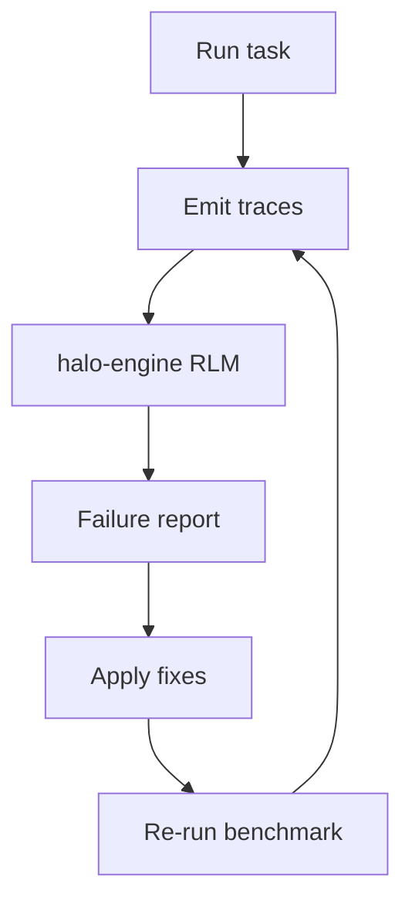

# avartan

A minimal terminal coding agent built in Python. Talks to an LLM over [OpenRouter](https://openrouter.ai/), calls tools to read/write files, run shell commands, search the web, and spawn sub-agents.

```bash
pipx install -e .
avartan
```

## Install

```bash
python3 -m venv .venv && source .venv/bin/activate
pip install -e .
```

Or globally, no venv:

```bash
pipx install -e .
```

Add your keys to `.env` (gitignored):

```
OPENROUTER_API_KEY=...
FIRECRAWL_API_KEY=...
```

## Usage

```bash
avartan                              # interactive REPL
avartan --task "list the files here" # one-shot, non-interactive
avartan --task-file task.txt --max-iterations 20
```

Drop an `AVARTAN.md` in a project's root to append project-specific instructions to the system prompt when run from that directory.

## Architecture

```
avartan.py    CLI entry point — env loading, system prompt, tool registry, REPL / --task mode
agent.py      run_turn() — the streaming + tool-calling loop
tools.py      Tool base class + every concrete tool
```

`run_turn()` is the only agent logic in the project: streams the model's response, accumulates tool-call fragments, executes tools, and loops until `finish_reason == "stop"`. The same function drives the REPL, `--task` mode, and sub-agents — differing only in `auto_approve` and `max_iterations`.

## Tools

| Tool | Read-only | Purpose |
|---|:---:|---|
| `read_file` | ✅ | Read a file |
| `write_file` | ❌ | Write/overwrite a file |
| `edit_file` | ❌ | Replace an exact string in a file |
| `grep` | ✅ | Regex search across a directory |
| `bash` | ❌ | Run a shell command |
| `todo_write` | ✅ | Plan/track a checklist |
| `web_search` | ✅ | Firecrawl web search |
| `task` | ❌ | Spawn a sub-agent to completion |

Non-read-only tools require `[y/n]` confirmation unless `auto_approve=True` or plan mode is active (`/plan` in the REPL — auto-denies edits, forcing research + a `todo_write` plan instead).

## Benchmarks

Run through 2 rounds of [HALO](https://github.com/context-labs/HALO) (trace → RLM analysis → fix → re-measure) against [Terminal-Bench 2.1](https://www.tbench.ai/). 8 harness bugs found and fixed.

**11/35 tasks passed (31.4%)** — Poolside Laguna S 2.1 (free tier).




## License

MIT
